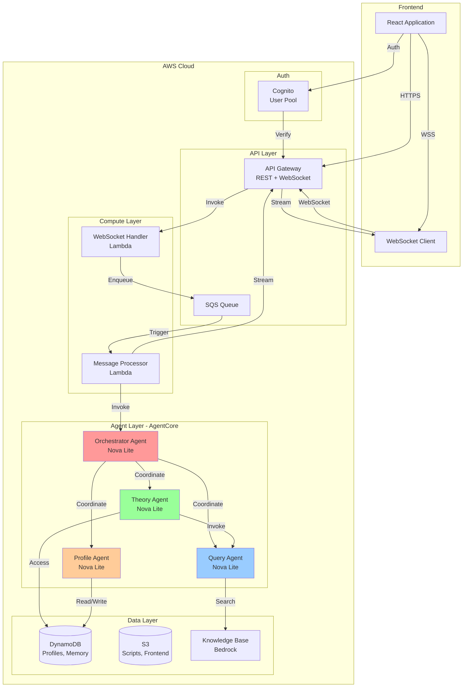
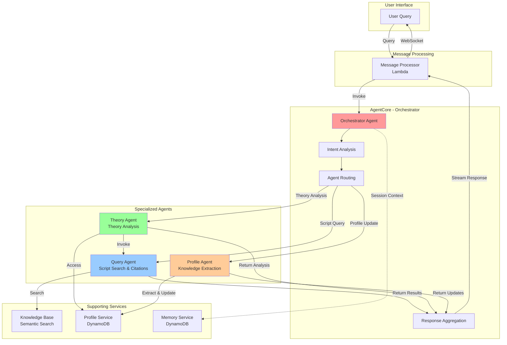
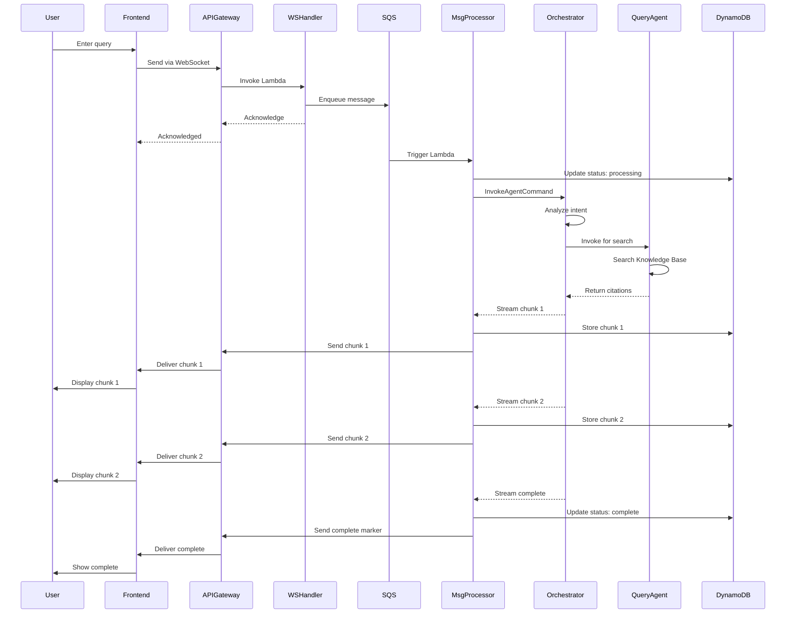
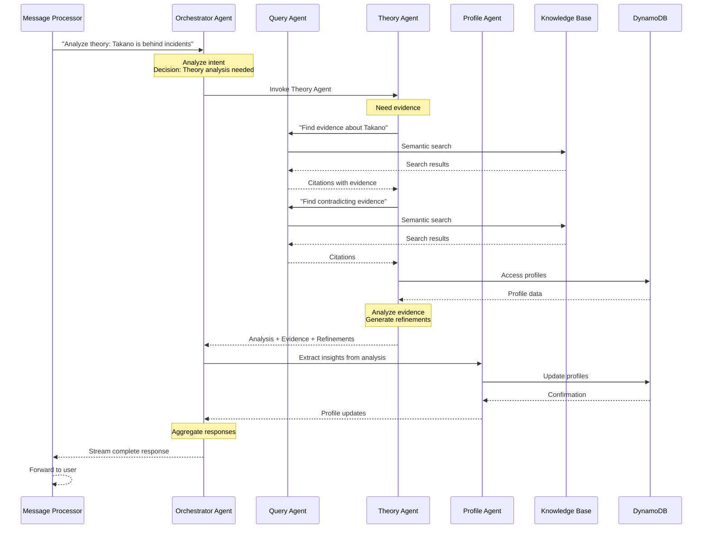
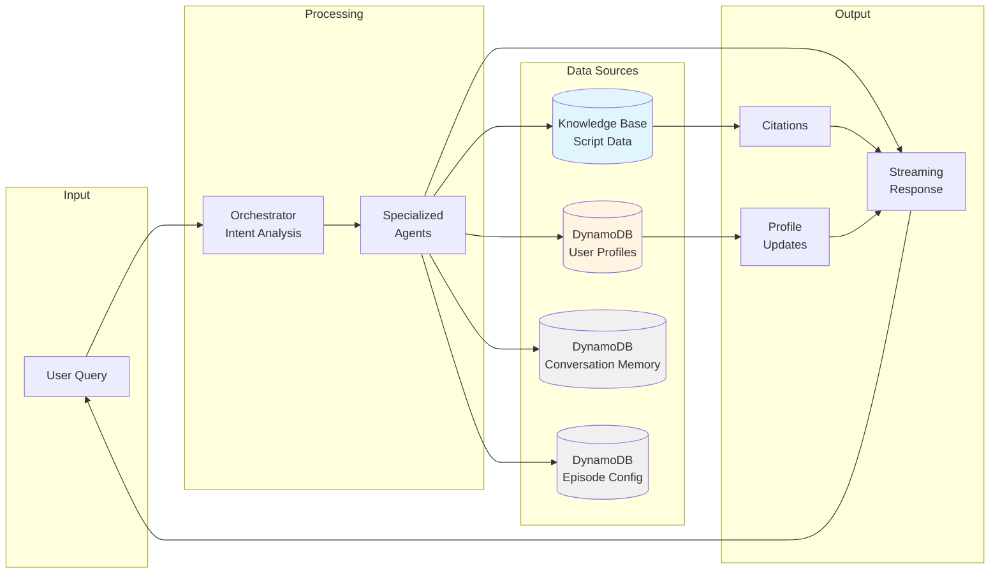
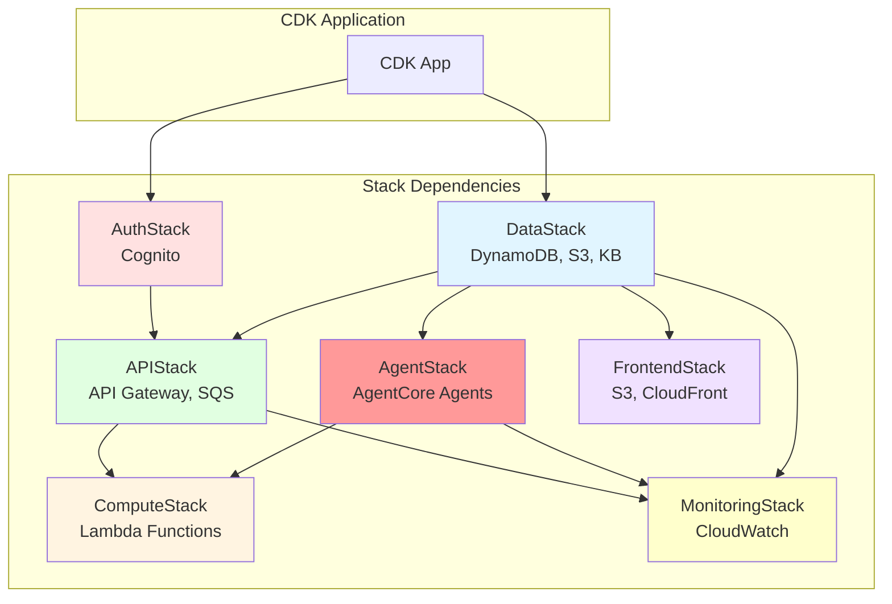
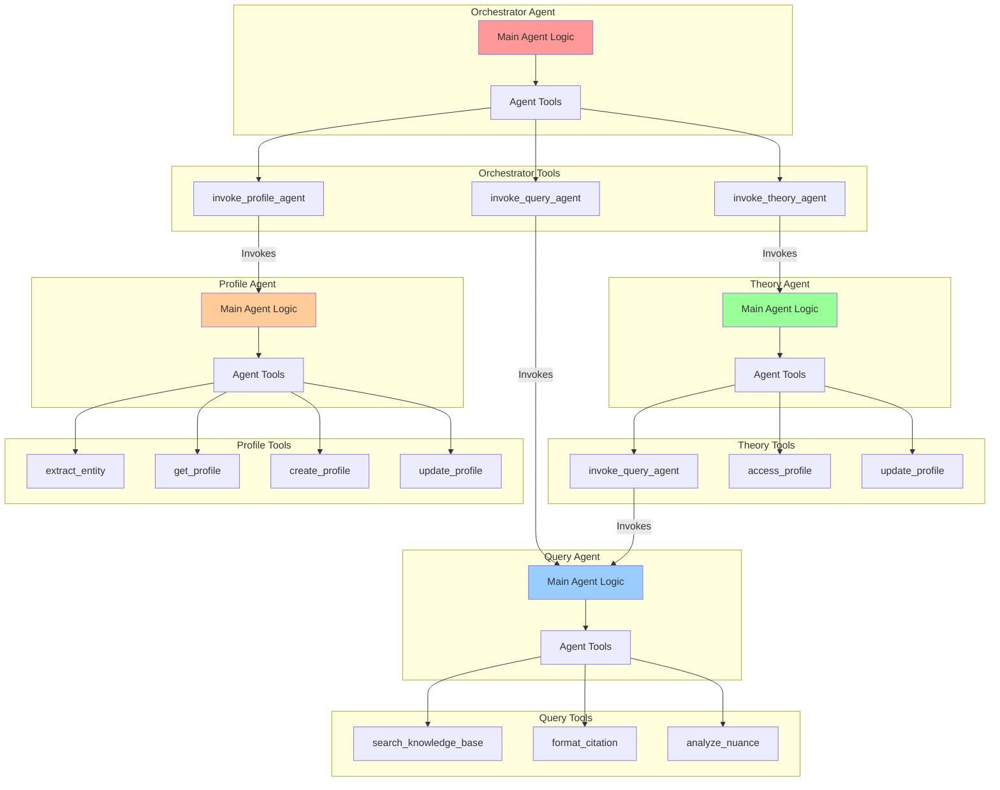
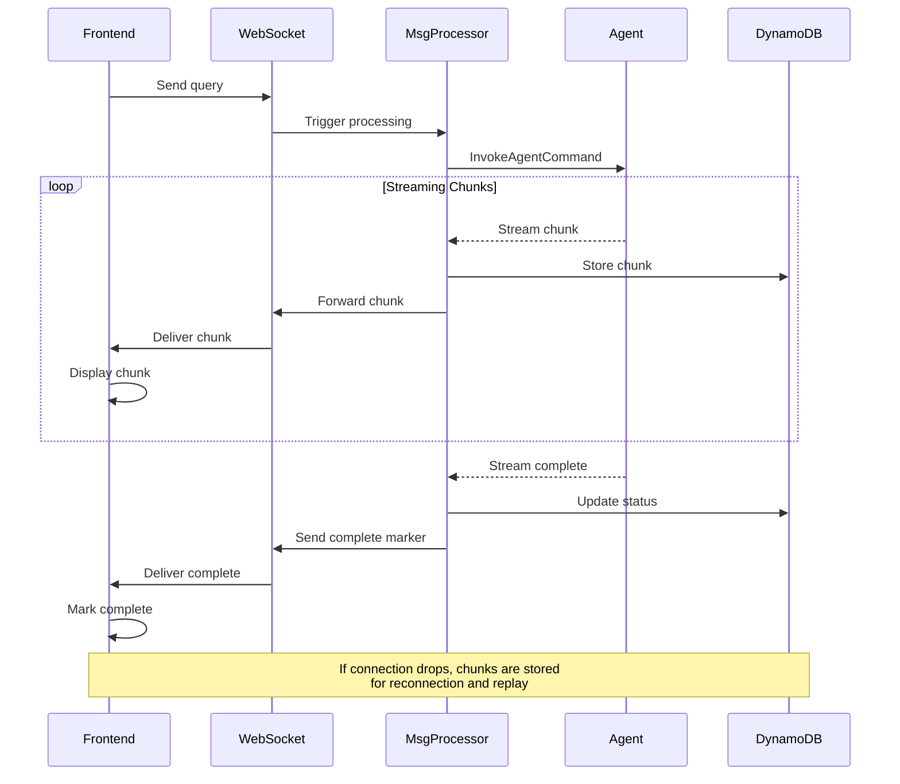
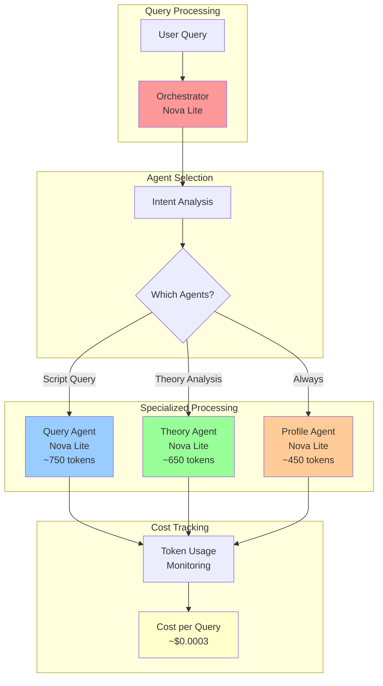
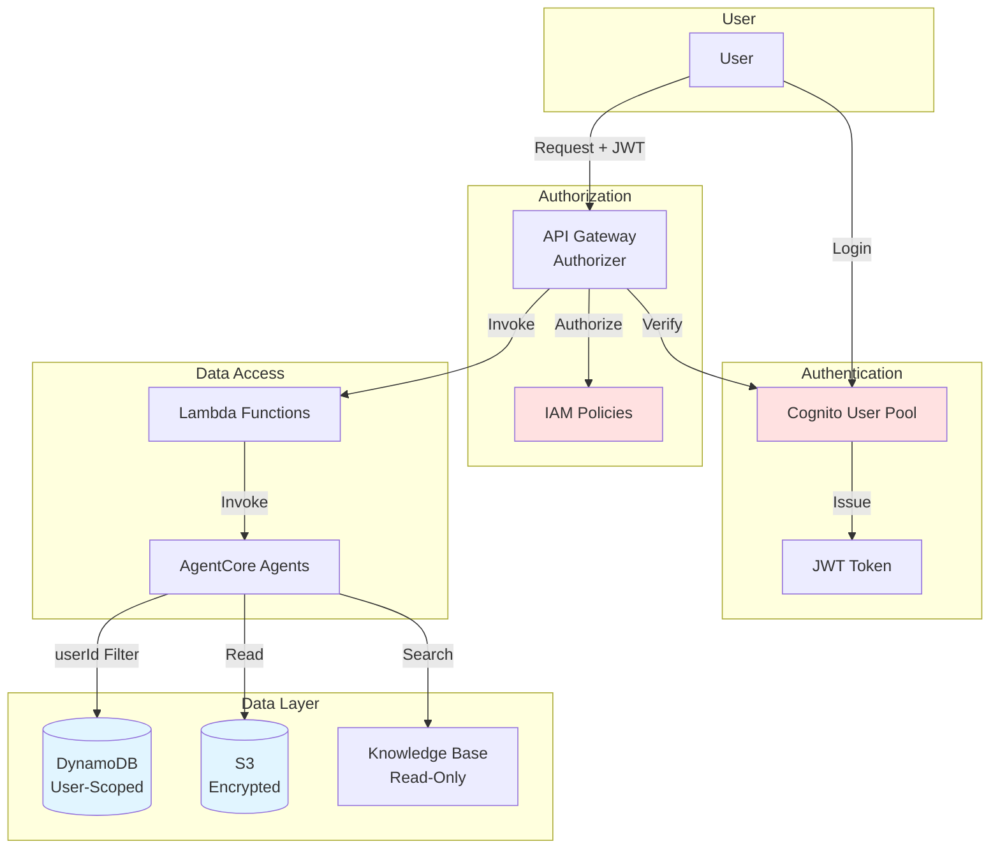

# CICADA Architecture Diagrams

This document provides visual representations of CICADA's architecture using Mermaid diagrams.

## Table of Contents

1. [High-Level System Architecture](#high-level-system-architecture)
2. [Multi-Agent Architecture](#multi-agent-architecture)
3. [Request Flow](#request-flow)
4. [Agent Coordination Flow](#agent-coordination-flow)
5. [Data Flow](#data-flow)
6. [Infrastructure Stacks](#infrastructure-stacks)

## High-Level System Architecture

## Multi-Agent Architecture

## Request Flow

## Agent Coordination Flow

## Data Flow

## Infrastructure Stacks

## Agent Tool Architecture

## Streaming Architecture

## Cost Optimization Flow

## Security Architecture

## References

- [AgentCore Architecture](../packages/backend/docs/AGENTCORE_ARCHITECTURE.md)
- [Agent Invocation Examples](../packages/backend/docs/AGENT_INVOCATION_EXAMPLES.md)
- [Streaming Implementation](../packages/backend/docs/STREAMING_IMPLEMENTATION.md)
- [Design Document](../.kiro/specs/agentcore-implementation/design.md)
